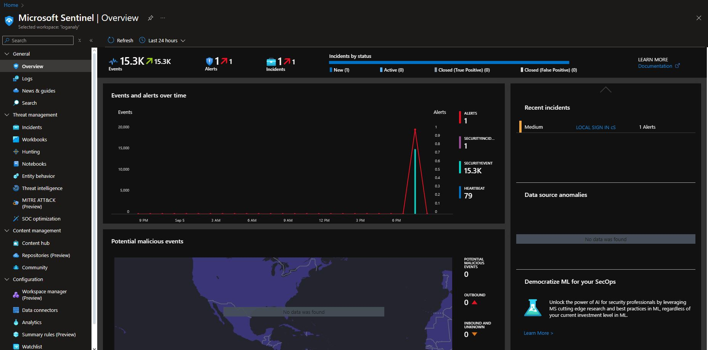
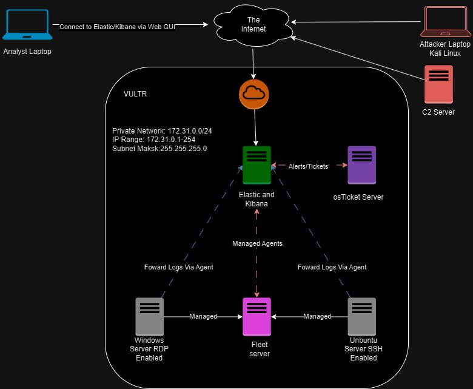

# SIEM Alert Example: Unauthorized Access Attempt

`Introduction`: In this example, I created a SIEM alert in Microsoft Azure to detect unauthorized access attempts to our network. 
This alert helps in identifying potential security breaches and taking immediate action to mitigate risks.

`Objective`: The primary objective of this alert is to monitor and detect any unauthorized access attempts to our network resources. This is crucial for maintaining the security and integrity of our systems.

`Configuration`: I configured the SIEM alert using Microsoft Azure Sentinel. The alert is set up to monitor login attempts across all network endpoints.

`Trigger Conditions`: The alert is triggered under the following conditions:

Multiple failed login attempts from a single IP address within a short time frame.
Login attempts from blacklisted IP addresses.
Login attempts outside of normal business hours.
Response: When the alert is triggered, the following actions are taken:

An automated email notification is sent to the security team.
The suspicious IP address is temporarily blocked.
A detailed log of the incident is created for further analysis.

`Outcome`: Since implementing this alert, we have successfully detected and blocked several unauthorized access attempts. 
This has significantly improved our network security posture. Additionally, the logs generated have been invaluable for conducting post-incident analysis and improving our security measures.




## Cybersecurity Network Architecture



`Analyst Laptop`:
Connects to the Elastic Stack via a web GUI for real-time monitoring and analysis of security logs.

`VULTR Cloud Instance`:
Hosts critical infrastructure components within a private network (172.31.0.0/24), ensuring secure and isolated operations.

`Elastic Stack`:
Centralized log management and analysis platform. It collects logs from managed agents on different servers and generates alerts based on predefined rules.

`OS Ticket Server`:
Receives alerts from the Elastic Stack and converts them into tickets for incident management and resolution.

`Fleet Server`:
Manages agents deployed on various servers, ensuring they are up-to-date and compliant with security policies.

`Managed Agents`:
Deployed on Windows Server (RDP Enabled) and Ubuntu Server (SSH Enabled) to forward logs to the Elastic Stack for analysis.

`Attacker Laptop (Kali Linux)`:
Represents a potential threat vector, used to simulate attacks and test the network’s defenses.
Data Flow:

`Purple Lines`: Represent managed connections between the Fleet server and the managed agents on the Windows and Ubuntu servers.
Red Lines: Indicate the flow of alerts and tickets from the Elastic Stack to the OS Ticket Server.
Black Lines: Show general connections, such as the analyst’s access to the Elastic Stack via the web GUI.
Key Features:

`Centralized Log Management`: The Elastic Stack collects and analyzes logs from various sources, providing a unified view of the network’s security posture.
Incident Management: Alerts generated by the Elastic Stack are forwarded to the OS Ticket Server, ensuring timely and organized incident response.
Agent Management: The Fleet server ensures that all managed agents are properly configured and maintained, enhancing the overall security of the network.


### Header 3

```js
// Javascript code with syntax highlighting.
var fun = function lang(l) {
  dateformat.i18n = require('./lang/' + l)
  return true;
}
```

```ruby
# Ruby code with syntax highlighting
GitHubPages::Dependencies.gems.each do |gem, version|
  s.add_dependency(gem, "= #{version}")
end
```

#### Header 4

*   This is an unordered list following a header.
*   This is an unordered list following a header.
*   This is an unordered list following a header.

##### Header 5

1.  This is an ordered list following a header.
2.  This is an ordered list following a header.
3.  This is an ordered list following a header.

###### Header 6

| head1        | head two          | three |
|:-------------|:------------------|:------|
| ok           | good swedish fish | nice  |
| out of stock | good and plenty   | nice  |
| ok           | good `oreos`      | hmm   |
| ok           | good `zoute` drop | yumm  |

### There's a horizontal rule below this.

* * *

### Here is an unordered list:

*   Item foo
*   Item bar
*   Item baz
*   Item zip

### And an ordered list:

1.  Item one
1.  Item two
1.  Item three
1.  Item four

### And a nested list:

- level 1 item
  - level 2 item
  - level 2 item
    - level 3 item
    - level 3 item
- level 1 item
  - level 2 item
  - level 2 item
  - level 2 item
- level 1 item
  - level 2 item
  - level 2 item
- level 1 item

### Small image


### Large image


### Definition lists can be used with HTML syntax.

<dl>
<dt>Name</dt>
<dd>Godzilla</dd>
<dt>Born</dt>
<dd>1952</dd>
<dt>Birthplace</dt>
<dd>Japan</dd>
<dt>Color</dt>
<dd>Green</dd>
</dl>

```
Long, single-line code blocks should not wrap. They should horizontally scroll if they are too long. This line should be long enough to demonstrate this.
```

```
The final element.
```
